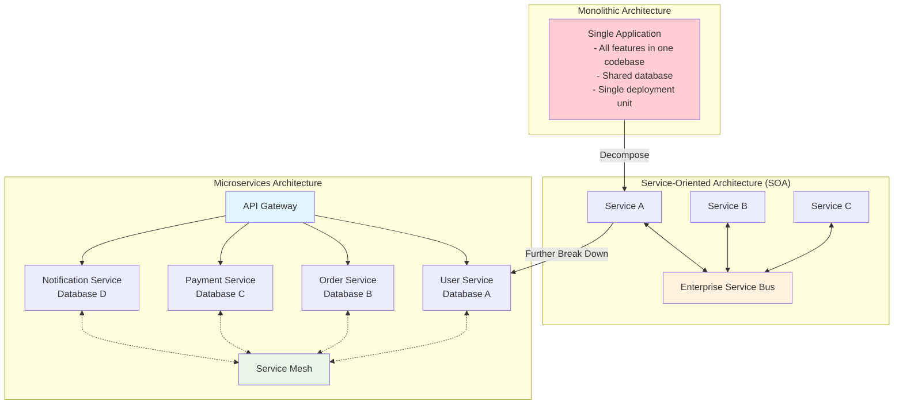
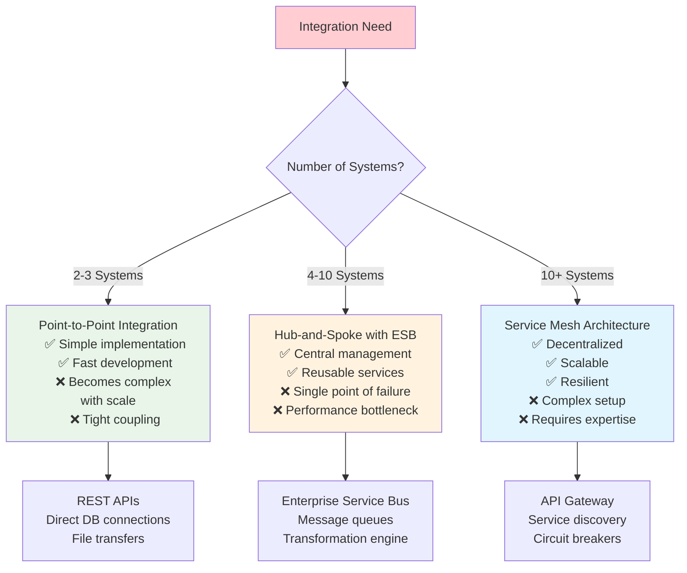
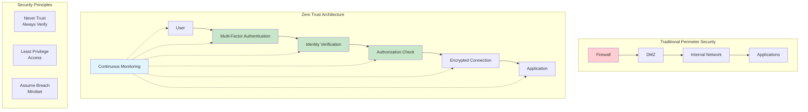
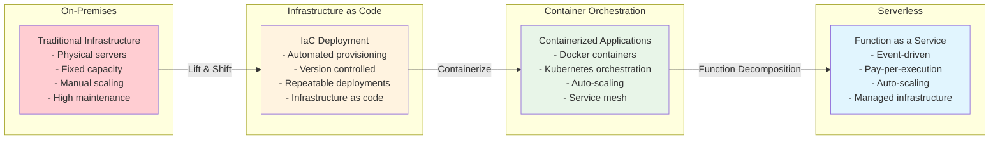
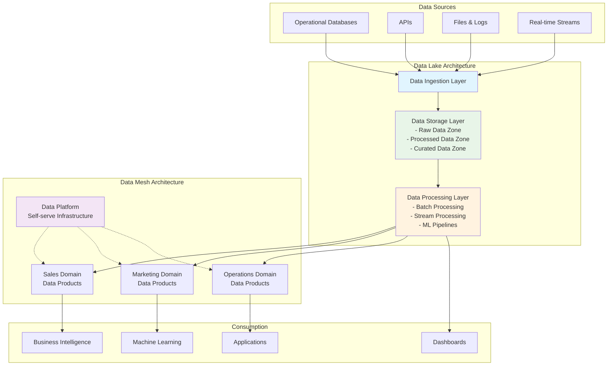
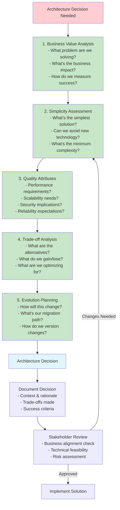

# Solution Architecture Patterns for Enterprise by Chanaka Fernando
## Complete Reference Guide: Chapter Notes, Principles, and Practical Applications

### Overview
This book provides a comprehensive guide to building enterprise software systems using proven solution architecture patterns. Based on the author's extensive experience across hundreds of organizations globally, it offers practical architecture diagrams and real-world examples for enterprise software development.

---

## **First-Timer's Guide: Thinking in Principles as a Solution Architect**

### **The "Why" Behind Solution Architecture - Core Principles**

#### **Principle 1: Business Value First (Why this matters)**
**The Why:** Every technical decision must create measurable business value. Without business alignment, even the most elegant architecture is worthless.

**As a First-Timer:**
- **Start Here:** Before any technical discussion, ask "What business problem are we solving?"
- **Your First Questions:** "How will this decision impact revenue, costs, or customer experience?"
- **Daily Practice:** Begin every architecture conversation with business context, not technology
- **Success Metric:** Stakeholders can explain the business value of your technical recommendations

**Practical First Steps:**
1. Create a simple business value template: Problem → Solution → Business Impact
2. Never propose a pattern without articulating its business benefit
3. Learn to translate technical benefits into business language (e.g., "microservices" = "faster feature delivery")

#### **Principle 2: Simplicity Over Complexity (Why simplicity wins)**
**The Why:** Complex solutions create maintenance burdens, increase failure points, and slow development. Simple solutions that solve the problem are always preferable to elegant solutions that over-engineer.

**As a First-Timer:**
- **Start Here:** Always ask "What's the simplest solution that could work?"
- **Your Mental Model:** Complexity is a cost that must be justified by proportional benefits
- **Daily Practice:** Present the simple solution first, then explain when complexity becomes necessary
- **Success Metric:** Development teams can implement and maintain your architectures without constant consultation

**Practical First Steps:**
1. Use the "Could we solve this with a simple API call?" test first
2. Document why complexity is necessary, not just how to implement it
3. Create a complexity budget for each project - track when you add complexity and why

#### **Principle 3: Quality Attributes Drive Design (Why non-functionals matter more)**
**The Why:** Functional requirements tell you what to build; quality attributes (performance, security, scalability) tell you how to build it. They often have more impact on architecture than features do.

**As a First-Timer:**
- **Start Here:** Quality attributes are not optional - they're requirements that shape architecture
- **Your Framework:** For every feature, ask about performance, security, scalability, and maintainability needs
- **Daily Practice:** Make quality attributes visible in every architecture discussion
- **Success Metric:** You can predict system behavior under stress, load, and failure conditions

**Practical First Steps:**
1. Create quality attribute requirement templates for common scenarios
2. Learn to quantify quality needs (e.g., "handles 1000 concurrent users" vs. "high performance")
3. Map patterns to quality attributes (e.g., microservices → scalability, caching → performance)

#### **Principle 4: Trade-offs Are Inevitable (Why there are no perfect solutions)**
**The Why:** Every architecture decision involves trade-offs. The skill is in making conscious trade-offs that align with business priorities, not in finding perfect solutions.

**As a First-Timer:**
- **Start Here:** Every pattern has pros and cons - your job is to match trade-offs to business priorities
- **Your Mindset:** Don't seek the "best" solution; seek the "best fit" solution
- **Daily Practice:** Explicitly discuss trade-offs with stakeholders, don't hide them
- **Success Metric:** Stakeholders understand and accept the trade-offs in your recommendations

**Practical First Steps:**
1. Create trade-off matrices for common patterns (e.g., monolith vs. microservices)
2. Always present alternatives with their trade-offs, not just your preferred option
3. Document the criteria used to make trade-off decisions for future reference

#### **Principle 5: Evolution Over Revolution (Why incremental wins)**
**The Why:** Large system rewrites fail more often than incremental improvements. Systems must evolve to meet changing needs, and evolutionary architecture enables this.

**As a First-Timer:**
- **Start Here:** Design for change, not just for current requirements
- **Your Planning Horizon:** Think in terms of 2-3 year evolution, not just initial implementation
- **Daily Practice:** Always ask "How will this decision help or hinder future changes?"
- **Success Metric:** Your architectures can adapt to changing requirements without major rewrites

**Practical First Steps:**
1. Include versioning strategies in all interface designs
2. Design loosely coupled components that can evolve independently
3. Plan migration strategies for any technology choices you make

### **Your First 30 Days: Principle-Driven Approach**

#### **Week 1: Establish Your "Why" Foundation**
**Daily Actions:**
- Read one business requirement and identify the underlying problem
- Practice translating technical concepts to business language
- Ask "Why is this important to the business?" in every meeting

**Key Deliverable:** One-page business context summary for your current project

#### **Week 2: Master Trade-off Thinking**
**Daily Actions:**
- For every technical decision you encounter, list 2-3 alternatives with pros/cons
- Practice explaining trade-offs to non-technical stakeholders
- Create simple trade-off matrices for common decisions in your domain

**Key Deliverable:** Trade-off analysis template for your most common architecture decisions

#### **Week 3: Quality Attributes Focus**
**Daily Actions:**
- Identify quality attributes for every system you encounter
- Quantify quality requirements where possible
- Connect patterns to quality attributes they address

**Key Deliverable:** Quality attribute requirements template for your organization

#### **Week 4: Integration and Practice**
**Daily Actions:**
- Apply all principles to one real architecture decision
- Present principle-based recommendations to stakeholders
- Document lessons learned and adjust your approach

**Key Deliverable:** Your first principle-driven architecture recommendation

### **Building Your Principle-Based Practice**

#### **The Solution Architect's Mental Model Shift**

**From Pattern Memorization → To Principle Application**
- **Old Thinking:** "I need to learn all the patterns"
- **New Thinking:** "I need to understand why patterns exist and when to apply them"

**From Technology-First → To Problem-First**
- **Old Thinking:** "This is a cool technology, where can I use it?"
- **New Thinking:** "What's the business problem, and which technology serves it best?"

**From Perfect Solutions → To Good Enough Solutions**
- **Old Thinking:** "I need to design the perfect architecture"
- **New Thinking:** "I need to design the right architecture for this context"

#### **Principle-Based Decision Framework (Your Daily Toolkit)**

**For Every Architecture Decision, Ask:**

1. **Business Value Principle:** "How does this create business value?"
   - What business problem does it solve?
   - What's the cost of not solving it?
   - How will success be measured?

2. **Simplicity Principle:** "What's the simplest solution that works?"
   - Can we solve this without adding new technology?
   - What's the minimum complexity needed?
   - How will complexity impact maintenance?

3. **Quality Attributes Principle:** "What quality attributes matter most?"
   - What are the performance requirements?
   - What are the security implications?
   - How must this scale?
   - What are the availability needs?

4. **Trade-offs Principle:** "What are we optimizing for?"
   - What are the alternatives?
   - What do we gain and lose with each option?
   - What trade-offs align with business priorities?

5. **Evolution Principle:** "How will this change over time?"
   - What might we need to change in 6-12 months?
   - How easy will it be to evolve this solution?
   - What's our migration strategy?

#### **Your First Architecture Review Using Principles**

**Preparation Questions:**
1. **Business Context:** What business outcome are we trying to achieve?
2. **Current State:** What's working and what's not in the current architecture?
3. **Constraints:** What can't we change (budget, timeline, technology, skills)?
4. **Success Criteria:** How will we know we've succeeded?

**Review Structure:**
1. **Present the Business Problem (5 minutes)**
   - State the problem in business terms
   - Explain the cost of inaction
   - Define success metrics

2. **Explain Your Principle-Based Analysis (10 minutes)**
   - Show how you applied each principle
   - Present alternatives you considered
   - Explain your reasoning, not just your conclusion

3. **Recommend the Solution (10 minutes)**
   - Present your recommendation with clear trade-offs
   - Explain how it addresses quality attributes
   - Show evolution path and migration strategy

4. **Address Questions and Concerns (15 minutes)**
   - Use principles to evaluate alternative suggestions
   - Acknowledge valid concerns and adjust if needed
   - Ensure stakeholder buy-in on trade-offs

### **Common First-Timer Pitfalls and How Principles Help**

#### **Pitfall 1: Technology Enthusiasm**
**The Problem:** Choosing exciting technology over business-appropriate technology
**Principle Solution:** Business Value First - always start with the business problem
**Practice:** Before proposing any technology, write down the business problem it solves

#### **Pitfall 2: Over-Engineering**
**The Problem:** Designing for hypothetical future requirements that may never come
**Principle Solution:** Simplicity Over Complexity - solve current problems simply
**Practice:** Present the simple solution first, then explain when complexity becomes necessary

#### **Pitfall 3: Ignoring Non-Functionals**
**The Problem:** Focusing only on features and ignoring performance, security, scalability
**Principle Solution:** Quality Attributes Drive Design - make non-functionals visible
**Practice:** Never discuss a feature without discussing its quality attribute implications

#### **Pitfall 4: Perfectionism**
**The Problem:** Spending too much time finding the "perfect" solution
**Principle Solution:** Trade-offs Are Inevitable - focus on the best fit, not the best solution
**Practice:** Always present 2-3 alternatives with their trade-offs

#### **Pitfall 5: Big Bang Thinking**
**The Problem:** Designing monolithic solutions that can't evolve
**Principle Solution:** Evolution Over Revolution - design for change
**Practice:** Include versioning and migration strategies in every design

### **Your Principle-Based Architecture Toolkit**

#### **Daily Templates**

**Business Problem Statement Template:**
```
Problem: [Business problem in business language]
Impact: [Cost of not solving this problem]
Success: [How we'll measure success]
Constraints: [What we can't change]
```

**Architecture Decision Template:**
```
Context: [Business and technical context]
Options: [2-3 alternatives considered]
Quality Attributes: [Performance, security, scalability needs]
Trade-offs: [What we gain/lose with each option]
Decision: [Chosen option and why]
Evolution: [How this can change over time]
```

**Stakeholder Communication Template:**
```
Business Problem: [Why we're doing this]
Proposed Solution: [What we're recommending]
Benefits: [Business value delivered]
Trade-offs: [What we're optimizing for]
Next Steps: [How to proceed]
```

#### **Quick Principle Checks**

**Before Any Architecture Meeting:**
- [ ] Can I explain the business problem in one sentence?
- [ ] Do I understand the quality attribute requirements?
- [ ] Have I considered 2-3 alternative approaches?
- [ ] Can I explain the trade-offs clearly?
- [ ] Do I know how this solution can evolve?

**After Any Architecture Decision:**
- [ ] Did I optimize for business value?
- [ ] Is this the simplest solution that works?
- [ ] Are quality attributes adequately addressed?
- [ ] Are trade-offs clearly understood by stakeholders?
- [ ] Can this solution evolve as requirements change?

### **Transitioning from Patterns to Principles - Your Growth Path**

#### **Level 1: Pattern Recognition (Weeks 1-4)**
**What You're Learning:** "This is how the patterns work"
**Focus Areas:**
- Memorizing common patterns from the book
- Understanding when each pattern is typically used
- Building a vocabulary of architectural solutions

**Principle Application:**
- Use business value principle to understand why each pattern exists
- Apply simplicity principle to understand when patterns add unnecessary complexity
- Connect patterns to the quality attributes they address

#### **Level 2: Context Application (Months 2-6)**
**What You're Learning:** "This is when to use these patterns"
**Focus Areas:**
- Recognizing the contexts where patterns apply
- Understanding the trade-offs between different patterns
- Making pattern selections based on requirements

**Principle Application:**
- Use trade-off principle to compare patterns systematically
- Apply evolution principle to choose patterns that can grow with the system
- Use quality attributes principle to match patterns to non-functional requirements

#### **Level 3: Principle Mastery (Months 6-12)**
**What You're Learning:** "This is why patterns exist and how to adapt them"
**Focus Areas:**
- Modifying patterns to fit specific contexts
- Creating hybrid solutions that combine multiple patterns
- Teaching others when and why to use patterns

**Principle Application:**
- Create new patterns based on principles rather than copying existing ones
- Explain pattern decisions in terms of business value and trade-offs
- Guide teams in principle-based architecture decisions

#### **Your Daily Routine as a Principle-Driven Solution Architect**

**Morning Preparation (15 minutes):**
1. Review the business context for today's architecture work
2. Identify the key quality attributes that will drive decisions
3. Prepare simple explanations for any technical concepts you'll discuss

**During Architecture Discussions:**
1. **Start with Why:** Begin every technical discussion with business context
2. **Make Trade-offs Visible:** Present alternatives, don't just advocate for one solution
3. **Quantify Quality:** Use specific numbers for performance, scalability, and availability requirements
4. **Think Evolution:** Discuss how decisions will impact future changes

**End of Day Reflection (10 minutes):**
1. What business problems did I help solve today?
2. What trade-offs did I help stakeholders understand?
3. How did my recommendations align with our architectural principles?
4. What did I learn about the business context that should influence future decisions?

### **Measuring Your Growth in Principle-Based Thinking**

#### **Month 1 Success Indicators:**
- [ ] You can explain any technical decision in business terms
- [ ] You ask "why" before "how" in architecture discussions
- [ ] You present alternatives with trade-offs, not just recommendations
- [ ] Stakeholders understand and accept the trade-offs in your solutions

#### **Month 3 Success Indicators:**
- [ ] You can predict which quality attributes matter most in new contexts
- [ ] You instinctively look for the simplest solution first
- [ ] You design solutions that can evolve with changing requirements
- [ ] Business stakeholders seek your input on technology strategy

#### **Month 6 Success Indicators:**
- [ ] You can create new patterns based on principles
- [ ] You help other architects think in principles, not just patterns
- [ ] You influence business decisions through architecture insights
- [ ] You're known for delivering business value through technical decisions

---

## Chapter 1: Introduction to Enterprise Software Systems

### Key Concepts:
- **Enterprise Software Definition**: Large-scale software systems designed to meet complex business requirements across organizations
- **Characteristics of Enterprise Systems**:
  - Scalability and performance requirements
  - High availability and reliability needs
  - Security and compliance considerations
  - Integration with multiple systems
  - Support for large user bases

### Key Learnings:
- Understanding the complexity and challenges of enterprise software development
- Distinction between enterprise software and traditional applications
- Business drivers for enterprise architecture decisions
- Importance of non-functional requirements in enterprise contexts
- Role of solution architects in enterprise environments

### Practical Applications:
- Framework for evaluating enterprise software requirements
- Principles for making architecture decisions in enterprise contexts
- Understanding stakeholder needs and business alignment

---

## Chapter 2: Fundamentals of Solution Architecture

### Key Concepts:
- **Solution Architecture vs. Enterprise Architecture**: Understanding the scope and focus differences
- **Architecture Patterns**: Reusable solutions to commonly occurring problems
- **Quality Attributes**: Performance, scalability, security, maintainability, availability
- **Architecture Views**: Different perspectives for different stakeholders

### Key Learnings:
- Role and responsibilities of solution architects
- Importance of documenting architecture decisions
- Balancing functional and non-functional requirements
- Communication strategies for technical and business stakeholders
- Architecture governance and compliance

### Practical Applications:
- Creating architecture documentation templates
- Stakeholder communication frameworks
- Decision-making processes for architecture choices
- Quality attribute requirement gathering techniques

---

## Chapter 3: Distributed Systems Architecture Patterns

### Key Concepts:
- **Microservices Architecture**: Breaking applications into small, independent services
- **Service-Oriented Architecture (SOA)**: Platform-independent service communication
- **Event-Driven Architecture**: Loose coupling through event-based communication
- **API-First Design**: Building systems around well-defined APIs

### Key Learnings:
- Trade-offs between monolithic and distributed architectures
- Service decomposition strategies
- Inter-service communication patterns
- Data consistency in distributed systems
- Monitoring and observability in distributed environments

### Practical Applications:
- Microservices decomposition strategies
- API design best practices
- Event streaming implementation patterns
- Service mesh architecture patterns

---

## Chapter 4: Enterprise Integration Patterns

### Key Concepts:
- **Enterprise Service Bus (ESB)**: Centralized integration infrastructure
- **Point-to-Point Integration**: Direct system connections
- **Hub-and-Spoke Architecture**: Central integration hub model
- **Message-Oriented Middleware**: Asynchronous messaging patterns

### Key Learnings:
- Integration pattern selection criteria
- Data transformation and mapping strategies
- Error handling and retry mechanisms
- Integration testing strategies
- Performance considerations in enterprise integration

### Practical Applications:
- Integration architecture blueprints
- Message queue implementation patterns
- Data synchronization strategies
- Legacy system integration approaches

---

## Chapter 5: Cloud-Native Architecture Patterns

### Key Concepts:
- **Cloud-First Design**: Building for cloud from the ground up
- **Containerization**: Docker and container orchestration patterns
- **Serverless Architecture**: Function-as-a-Service implementations
- **Cloud Service Models**: IaaS, PaaS, SaaS architectural implications

### Key Learnings:
- Cloud migration strategies and patterns
- Auto-scaling and elasticity design
- Cloud security architecture patterns
- Cost optimization in cloud architectures
- Multi-cloud and hybrid cloud considerations

### Practical Applications:
- Container deployment strategies
- Serverless application patterns
- Cloud-native data architecture
- DevOps integration with cloud architectures

---

## Chapter 6: Data Architecture Patterns for Enterprise

### Key Concepts:
- **Data Lake Architecture**: Centralized repository for structured and unstructured data
- **Data Warehouse Patterns**: Traditional and modern data warehousing approaches
- **Master Data Management**: Single source of truth for critical business data
- **Data Mesh**: Decentralized data architecture approach

### Key Learnings:
- Data governance and quality frameworks
- Real-time vs. batch processing patterns
- Data security and privacy considerations
- Analytics and business intelligence integration
- Data lineage and metadata management

### Practical Applications:
- Data pipeline architecture patterns
- Data lake implementation strategies
- Real-time analytics architectures
- Data governance frameworks

---

## Chapter 7: Security Architecture Patterns

### Key Concepts:
- **Zero Trust Architecture**: Never trust, always verify security model
- **Identity and Access Management (IAM)**: Authentication and authorization patterns
- **Security by Design**: Building security into architecture from the start
- **Threat Modeling**: Systematic approach to security risk assessment

### Key Learnings:
- Security pattern selection based on threat landscape
- Encryption and key management strategies
- Secure communication patterns
- Compliance and regulatory considerations
- Security monitoring and incident response

### Practical Applications:
- Identity provider integration patterns
- Secure API design patterns
- Security monitoring architectures
- Compliance framework implementations

---

## Chapter 8: Industry-Specific Solution Patterns

### Key Concepts:
- **Financial Services Patterns**: Banking, insurance, and fintech architectures
- **Healthcare Systems**: HIPAA compliance and healthcare interoperability
- **Retail and E-commerce**: High-volume transaction processing
- **Manufacturing**: Industrial IoT and supply chain integration

### Key Learnings:
- Industry-specific compliance requirements
- Domain-specific architecture considerations
- Regulatory impact on architecture decisions
- Industry standard protocols and frameworks
- Vertical integration patterns

### Practical Applications:
- Compliance-driven architecture patterns
- Industry-specific integration strategies
- Regulatory reporting architectures
- Domain-specific data models

---

## Chapter 9: Future of Solution Architecture

### Key Concepts:
- **Artificial Intelligence Integration**: AI/ML in enterprise architectures
- **Edge Computing**: Distributed computing at the network edge
- **Quantum Computing Impact**: Preparing for quantum computing era
- **Sustainable Architecture**: Green computing and environmental considerations

### Key Learnings:
- Emerging technology adoption strategies
- Future-proofing architecture decisions
- Technology trend analysis and evaluation
- Continuous learning and adaptation in architecture
- Innovation management in enterprise contexts

### Practical Applications:
- AI/ML integration patterns
- Edge computing architectures
- Technology roadmap development
- Innovation laboratory setups

---

## **Practical Application Framework for Solution Architects**

### **Daily Application in Your Solution Architect Role**

#### **1. Requirements Gathering and Analysis**
**How to Apply:**
- Use enterprise software characteristics framework (Chapter 1) to identify non-functional requirements early
- Apply quality attribute worksheets to systematically capture performance, security, and scalability needs
- Leverage industry-specific patterns (Chapter 8) to understand domain requirements faster

**Immediate Actions:**
- Create requirement templates based on enterprise software characteristics
- Build stakeholder interview guides using quality attributes framework
- Develop domain-specific requirement checklists for your industry

#### **2. Architecture Design and Pattern Selection**
**How to Apply:**
- Use pattern decision matrices from Chapters 3-7 to systematically evaluate options
- Apply the "business value first" principle - always map patterns to business outcomes
- Leverage the distributed systems patterns (Chapter 3) for modern application design

**Immediate Actions:**
- Create a pattern selection decision tree for common scenarios
- Build reusable architecture templates for microservices, integration, and cloud patterns
- Develop cost-benefit analysis templates for pattern comparison

#### **3. Stakeholder Communication**
**How to Apply:**
- Use layered architecture views to communicate with different audiences (business vs. technical)
- Apply visual pattern diagrams to explain complex concepts simply
- Leverage business alignment principles to justify technical decisions

**Immediate Actions:**
- Create standard presentation templates for different stakeholder types
- Build a library of visual pattern diagrams for quick reuse
- Develop business case templates linking patterns to ROI

#### **4. Risk Assessment and Mitigation**
**How to Apply:**
- Use security architecture patterns (Chapter 7) for systematic threat assessment
- Apply integration patterns (Chapter 4) to identify and mitigate integration risks
- Leverage cloud-native patterns (Chapter 5) to assess cloud migration risks

**Immediate Actions:**
- Create risk assessment checklists for each pattern category
- Build risk mitigation playbooks for common enterprise scenarios
- Develop cloud readiness assessment frameworks

### **Chapter-by-Chapter Application in Your Role**

#### **Chapter 1 & 2 Applications**
**Weekly Activities:**
- Use enterprise complexity assessment during project initiation
- Apply architecture documentation standards for all new projects
- Conduct stakeholder analysis using the framework provided

**Monthly Activities:**
- Review and update your architecture principles based on lessons learned
- Assess architecture governance maturity in your organization
- Update architecture decision record templates

#### **Chapter 3 - Distributed Systems Applications**
**Project-Level Applications:**
- Apply service decomposition strategies for new microservices initiatives
- Use API-first design principles for all new integrations
- Implement event-driven patterns for real-time data processing needs

**Daily Applications:**
- Review existing systems using distributed patterns lens
- Evaluate service boundaries during design sessions
- Apply monitoring and observability patterns to new services

#### **Chapter 4 - Enterprise Integration Applications**
**Strategic Applications:**
- Use integration pattern selection criteria for enterprise integration decisions
- Apply ESB vs. point-to-point analysis for integration architecture
- Implement data transformation strategies for system integration

**Tactical Applications:**
- Design error handling and retry mechanisms for all integrations
- Create integration testing strategies using the patterns
- Apply message queue patterns for asynchronous processing

#### **Chapter 5 - Cloud-Native Applications**
**Immediate Applications:**
- Use cloud-first design principles for all new projects
- Apply containerization patterns for application modernization
- Implement auto-scaling patterns for variable workloads

**Long-term Applications:**
- Develop cloud migration strategies using the patterns
- Apply multi-cloud patterns for vendor independence
- Implement DevOps integration patterns

#### **Chapter 6 - Data Architecture Applications**
**Strategic Applications:**
- Apply data lake vs. data warehouse decision frameworks
- Use master data management patterns for data governance
- Implement data mesh patterns for large-scale data democratization

**Operational Applications:**
- Design real-time analytics architectures using the patterns
- Apply data pipeline patterns for ETL/ELT processes
- Implement data lineage tracking using the frameworks

#### **Chapter 7 - Security Applications**
**Critical Applications:**
- Apply zero-trust architecture principles to all new designs
- Use IAM patterns for identity and access management
- Implement security-by-design in all architecture decisions

**Compliance Applications:**
- Apply threat modeling systematically to new architectures
- Use compliance framework patterns for regulatory requirements
- Implement security monitoring patterns

### **Building Your Architecture Practice**

#### **Short-term (1-3 months)**
1. **Pattern Library Development**
   - Create your organization's pattern catalog based on the book
   - Develop decision trees for pattern selection
   - Build reusable architecture templates

2. **Stakeholder Engagement**
   - Implement business alignment frameworks
   - Create architecture review processes
   - Develop communication standards

#### **Medium-term (3-12 months)**
1. **Capability Building**
   - Train development teams on selected patterns
   - Establish architecture governance processes
   - Build center of excellence for architecture

2. **Tool Integration**
   - Implement architecture documentation tools
   - Create pattern automation in deployment pipelines
   - Build monitoring for architectural compliance

#### **Long-term (1+ years)**
1. **Organizational Transformation**
   - Establish architecture-driven development culture
   - Implement continuous architecture evolution
   - Build innovation laboratories for emerging patterns

### **Measuring Success in Your Role**

#### **Key Performance Indicators**
- **Time to Architecture**: Reduce time from requirements to architecture design
- **Pattern Reuse Rate**: Increase reuse of proven patterns across projects
- **Stakeholder Satisfaction**: Improve architecture communication effectiveness
- **Risk Reduction**: Decrease architecture-related project risks
- **Business Alignment**: Increase business value delivery through architecture

#### **Career Development Applications**
1. **Technical Leadership**
   - Use patterns to guide technical decision-making across teams
   - Apply frameworks to mentor junior architects
   - Lead architecture communities of practice

2. **Business Partnership**
   - Leverage business alignment principles for executive communication
   - Use ROI frameworks from patterns to justify architecture investments
   - Apply industry-specific patterns for domain expertise

3. **Innovation Leadership**
   - Use emerging technology patterns (Chapter 9) for innovation roadmaps
   - Apply experimentation frameworks for new pattern evaluation
   - Lead digital transformation initiatives using proven patterns

### **Quick Reference for Daily Use**

#### **Architecture Decision Template**
1. **Context**: What business problem are we solving?
2. **Options**: Which patterns could address this problem?
3. **Criteria**: What quality attributes matter most?
4. **Decision**: Which pattern provides the best fit?
5. **Consequences**: What are the implications of this choice?

#### **Pattern Selection Checklist**
- ✓ Business alignment verified
- ✓ Quality attributes addressed
- ✓ Risk assessment completed
- ✓ Implementation feasibility confirmed
- ✓ Stakeholder buy-in obtained
- ✓ Success metrics defined

---

## **Key Takeaways from the Entire Book**

### **Core Principles:**
1. **Pattern-Based Thinking**: Reuse proven solutions rather than reinventing
2. **Business Alignment**: Always connect architecture decisions to business value
3. **Quality-Driven Design**: Non-functional requirements are as important as functional ones
4. **Evolution Over Revolution**: Incremental improvement and modernization strategies
5. **Documentation and Communication**: Architecture is useless if not properly communicated

### **Implementation Guidelines:**
- Start with business requirements and work toward technical solutions
- Consider the full system lifecycle, not just initial implementation
- Plan for change and evolution from the beginning
- Invest in architecture governance and review processes
- Build capability within the organization, not just systems

### **Success Factors:**
- Strong stakeholder engagement and communication
- Clear architecture principles and guidelines
- Regular architecture reviews and assessments
- Continuous learning and adaptation
- Balance between standardization and flexibility

### **Common Pitfalls to Avoid:**
- Over-engineering solutions for current needs
- Ignoring non-functional requirements until late in the process
- Poor documentation and knowledge transfer
- Lack of architecture governance
- Technology-driven rather than business-driven decisions

---

## **Visual Diagrams and Architecture Models Section**

### **Core Architecture Visualization Frameworks**

#### **The C4 Model - Software Architecture Diagramming**

**What is C4:** The C4 model is an easy to learn, developer friendly approach to software architecture diagramming, created by Simon Brown. C4 stands for Context, Container, Component, and Code — the four levels of this model.

**Why Use C4:** Good software architecture diagrams assist with communication inside and outside of software development/product teams, efficient onboarding of new staff, architecture reviews/evaluations, risk identification.

**The Four Levels:**

```mermaid
graph TD
    QA[Quality Attributes Analysis] --> P[Performance Required?]
    QA --> S[Scalability Needed?]
    QA --> R[Reliability Critical?]
    QA --> SEC[Security Important?]
    QA --> M[Maintainability Priority?]
    
    P -->|High| P1[Caching Patterns<br/>CDN<br/>Load Balancing]
    P -->|Medium| P2[Optimized Queries<br/>Connection Pooling]
    P -->|Low| P3[Standard Patterns OK]
    
    S -->|High| S1[Microservices<br/>Auto-scaling<br/>Load Distribution]
    S -->|Medium| S2[Horizontal Scaling<br/>Stateless Design]
    S -->|Low| S3[Monolithic OK<br/>Vertical Scaling]
    
    R -->|High| R1[Circuit Breaker<br/>Redundancy<br/>Failover]
    R -->|Medium| R2[Retry Mechanisms<br/>Health Checks]
    R -->|Low| R3[Basic Error Handling]
    
    SEC -->|High| SEC1[Zero Trust<br/>Multi-factor Auth<br/>Encryption]
    SEC -->|Medium| SEC2[Standard Auth<br/>HTTPS/TLS]
    SEC -->|Low| SEC3[Basic Security]
    
    M -->|High| M1[Modular Design<br/>Clean Architecture<br/>DDD]
    M -->|Medium| M2[Layered Architecture<br/>Separation of Concerns]
    M -->|Low| M3[Simple Structure]
    
    style QA fill:#ffcdd2
    style P1 fill:#c8e6c9
    style S1 fill:#c8e6c9
    style R1 fill:#c8e6c9
    style SEC1 fill:#c8e6c9
    style M1 fill:#c8e6c9
```



#### **Microservices Architecture Pattern**

**From Monolith to Microservices Evolution:**



#### **Integration Patterns Comparison**

**Enterprise Integration Pattern Selection:**



#### **Security Architecture Patterns**

**Zero Trust Architecture Implementation:**



#### **Cloud Architecture Evolution**

**Cloud Migration Patterns:**



#### **Data Architecture Patterns**

**Modern Data Architecture Evolution:**



#### **Decision Framework Visualization**

**Principle-Based Architecture Decision Process:**



### **How to Use These Diagrams**

#### **For Stakeholder Communication:**
1. **Use C4 Level 1** for executive presentations - shows business context
2. **Use TOGAF ADM diagram** to explain your architecture process
3. **Use decision framework** to show your systematic approach

#### **For Technical Teams:**
1. **Use C4 Level 2-3** for development planning
2. **Use pattern comparison diagrams** for technology selection
3. **Use quality attributes matrix** for non-functional requirements

#### **For Architecture Reviews:**
1. **Use evolution diagrams** to show migration paths
2. **Use trade-off visualizations** to explain decisions
3. **Use principle-based process** to validate approach

#### **For Documentation:**
1. **Include relevant pattern diagrams** in architecture documents
2. **Use decision trees** to explain selection criteria
3. **Reference quality attribute matrices** for requirements traceability

These visual representations make complex architecture concepts accessible to different audiences and support the principle-based approach to solution architecture outlined in the book.

---

## **Resources Section**

### **Core Architecture Pattern Libraries**

#### **1. Martin Fowler's Enterprise Application Architecture Patterns**
- **URL:** https://martinfowler.com/eaaCatalog/
- **Description:** A catalog of patterns to better understand, communicate, and teach the architecture of enterprise applications
- **Why It's Essential:** Foundational patterns for data access, web presentation, distribution, and offline concurrency
- **How to Use:** Reference for understanding the "why" behind common enterprise patterns

#### **2. Enterprise Integration Patterns**
- **URL:** https://www.enterpriseintegrationpatterns.com
- **Description:** A comprehensive pattern language for the robust design of asynchronous messaging solutions. The patterns stay product neutral and emphasize design trade-offs over specific technology choices
- **Why It's Essential:** Definitive guide for integration architecture decisions
- **How to Use:** Apply when designing system-to-system communication and messaging architectures

#### **3. Martin Fowler's Enterprise Patterns Article**
- **URL:** https://martinfowler.com/articles/enterprisePatterns.html
- **Description:** Long-form article explaining patterns in enterprise software
- **Why It's Essential:** Deeper context on when and why to use enterprise patterns
- **How to Use:** Read for principle-based understanding of pattern selection

### **Enterprise Architecture Frameworks**

#### **4. TOGAF (The Open Group Architecture Framework)**
- **Official Documentation:** https://www.opengroup.org/togaf
- **Key Resource:** ADM (Architecture Development Method) and framework mappings
- **Why It's Essential:** TOGAF focuses on business and IT alignment, emphasising delivering business value through IT
- **How to Use:** Apply ADM phases for structured architecture development
- **Principle Connection:** Aligns directly with "Business Value First" principle

#### **5. Zachman Framework**
- **Official Site:** https://zachman-feac.com/
- **Key Resource:** Principles include comprehensive classification and organization, providing a holistic view, ensuring business-IT alignment
- **Why It's Essential:** Matrix structure to analyze and document the different aspects of a solution. Each cell represents a specific viewpoint, such as business objectives, system specifications, or technology infrastructure
- **How to Use:** Use the 6x6 matrix for comprehensive solution documentation
- **Principle Connection:** Supports "Quality Attributes Drive Design" through systematic viewpoint analysis

#### **6. Comparison of Enterprise Architecture Frameworks**
- **URL:** https://www.bcs.org/articles-opinion-and-research/a-comparison-of-the-top-four-enterprise-architecture-frameworks/
- **Additional Resource:** https://www.leanix.net/en/blog/5-enterprise-architecture-frameworks
- **Why It's Essential:** Helps choose the right framework for your context
- **How to Use:** Reference when selecting architectural methodology
- **Principle Connection:** Supports "Trade-offs Are Inevitable" by showing framework comparisons

### **Cloud Architecture and Modern Patterns**

#### **7. AWS Well-Architected Framework**
- **URL:** https://aws.amazon.com/architecture/well-architected/
- **Key Pillars:** Operational Excellence, Security, Reliability, Performance Efficiency, Cost Optimization, Sustainability
- **Why It's Essential:** Modern cloud-native architecture principles
- **How to Use:** Apply pillars as quality attributes in cloud solution design
- **Principle Connection:** Direct implementation of "Quality Attributes Drive Design"

#### **8. Microsoft Azure Architecture Center**
- **URL:** https://docs.microsoft.com/en-us/azure/architecture/
- **Key Resources:** Reference architectures, design patterns, best practices
- **Why It's Essential:** Cloud-specific patterns and anti-patterns
- **How to Use:** Reference for cloud migration and modernization patterns
- **Principle Connection:** Supports "Evolution Over Revolution" with migration patterns

#### **9. Google Cloud Architecture Framework**
- **URL:** https://cloud.google.com/architecture/framework
- **Key Areas:** System design, operational excellence, security privacy compliance, reliability
- **Why It's Essential:** Google's approach to cloud architecture principles
- **How to Use:** Reference for distributed systems and scalability patterns
- **Principle Connection:** Aligns with "Simplicity Over Complexity" philosophy

### **Microservices and Distributed Systems**

#### **10. Microservices.io**
- **URL:** https://microservices.io/
- **Creator:** Chris Richardson
- **Why It's Essential:** Comprehensive microservices pattern library
- **How to Use:** Reference for service decomposition and distributed system patterns
- **Principle Connection:** Supports all five principles through pattern trade-off analysis

#### **11. Building Microservices Patterns**
- **Resource:** Sam Newman's microservices patterns documentation
- **Why It's Essential:** Practical guidance on microservices implementation
- **How to Use:** Apply when decomposing monolithic systems
- **Principle Connection:** "Evolution Over Revolution" through incremental decomposition

### **DevOps and Operational Patterns**

#### **12. The Twelve-Factor App**
- **URL:** https://12factor.net/
- **Why It's Essential:** Principles for building software-as-a-service applications
- **How to Use:** Apply as design principles for cloud-native applications
- **Principle Connection:** Direct implementation of "Evolution Over Revolution"

#### **13. Site Reliability Engineering (SRE) Principles**
- **URL:** https://sre.google/
- **Key Resource:** Google's SRE books and practices
- **Why It's Essential:** Operational aspects of system reliability
- **How to Use:** Apply for system reliability and operational excellence
- **Principle Connection:** Supports "Quality Attributes Drive Design" for reliability

### **Security Architecture**

#### **14. OWASP Application Security Architecture**
- **URL:** https://owasp.org/www-project-integration-standards/
- **Why It's Essential:** Security patterns and anti-patterns
- **How to Use:** Reference for security architecture decisions
- **Principle Connection:** Critical component of "Quality Attributes Drive Design"

#### **15. NIST Cybersecurity Framework**
- **URL:** https://www.nist.gov/cyberframework
- **Why It's Essential:** Structured approach to cybersecurity
- **How to Use:** Framework for security architecture planning
- **Principle Connection:** Supports systematic security thinking

### **Industry-Specific Patterns**

#### **16. FinTech Architecture Patterns**
- **Resource:** Financial services architecture repositories
- **Why It's Essential:** Industry-specific compliance and patterns
- **How to Use:** Reference for financial services solution architecture
- **Principle Connection:** Context-specific application of all principles

#### **17. Healthcare Architecture Standards**
- **Resource:** HL7 FHIR and healthcare interoperability standards
- **URL:** https://hl7.org/fhir/
- **Why It's Essential:** Healthcare-specific integration patterns
- **How to Use:** Apply for healthcare system integration
- **Principle Connection:** Industry application of integration principles

### **Learning and Community Resources**

#### **18. Enterprise Architecture Guilds and Communities**
- **The Open Group:** https://www.opengroup.org/
- **Enterprise Architecture Professional:** Various professional associations
- **Why It's Essential:** Peer learning and best practices sharing
- **How to Use:** Engage for continuous learning and networking

#### **19. Architecture Decision Records (ADR)**
- **Template Repository:** https://adr.github.io/
- **Why It's Essential:** Document architecture decisions systematically
- **How to Use:** Implement ADR practice for decision tracking
- **Principle Connection:** Critical for "Trade-offs Are Inevitable" documentation

#### **20. C4 Model for Software Architecture**
- **URL:** https://c4model.com/
- **Why It's Essential:** Simple approach to software architecture diagramming
- **How to Use:** Standardize architecture communication
- **Principle Connection:** Supports clear stakeholder communication

### **How to Use These Resources in Your Practice**

#### **Daily Reference:**
1. **Martin Fowler's Catalogs:** For pattern selection and understanding
2. **Cloud Provider Frameworks:** For quality attribute requirements
3. **ADR Templates:** For documenting decisions

#### **Weekly Learning:**
1. **Framework Documentation:** Deep dive into TOGAF or Zachman concepts
2. **Industry Resources:** Stay updated on domain-specific patterns
3. **Community Discussions:** Engage with architecture communities

#### **Monthly Review:**
1. **Pattern Libraries:** Review new patterns and updates
2. **Framework Updates:** Check for new versions and guidance
3. **Principle Application:** Assess how well you're applying the five principles

#### **Project-Specific:**
1. **Architecture Frameworks:** Choose appropriate methodology
2. **Pattern Libraries:** Select patterns based on quality attributes
3. **Industry Standards:** Apply domain-specific requirements

These resources provide the documented foundation for the principles and practices outlined in the book, giving you authoritative sources to reference and learn from as you develop your solution architecture expertise.
    A["Level 1: System Context
    🌐 Big Picture View
    Shows how your system fits in the world
    People, other systems, external dependencies"] --> B["Level 2: Container
    🏗️ High-Level Technology Choices
    Applications, data stores, microservices
    Technology decisions and communication"]
    
    B --> C["Level 3: Component
    🔧 Inside Each Container
    Major structural building blocks
    Their responsibilities and interactions"]
    
    C --> D["Level 4: Code
    💻 Implementation Details
    Classes, interfaces, functions
    Zoom into specific components"]
    
    style A fill:#e1f5fe
    style B fill:#e8f5e8
    style C fill:#fff3e0
    style D fill:#fce4ec
```

**Application to Solution Architecture:**
- **Level 1 (Context):** Perfect for stakeholder communication - shows business context
- **Level 2 (Container):** Ideal for solution architects - shows technical boundaries and deployments
- **Level 3 (Component):** Useful for development team communication
- **Level 4 (Code):** Developer-focused, rarely needed at solution architecture level

#### **TOGAF ADM Process Visualization**

**TOGAF Architecture Development Method (ADM) Cycle:**


#### **Enterprise Architecture Pattern Categories**

**Solution Architecture Pattern Hierarchy:**


